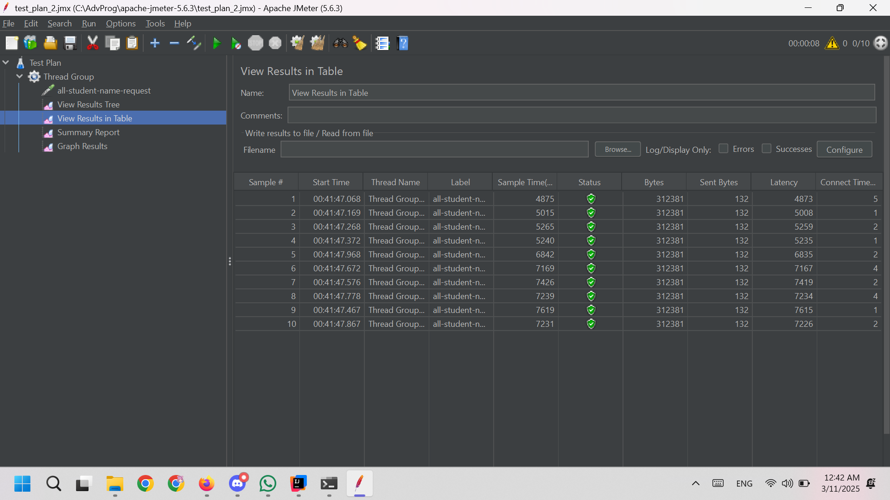
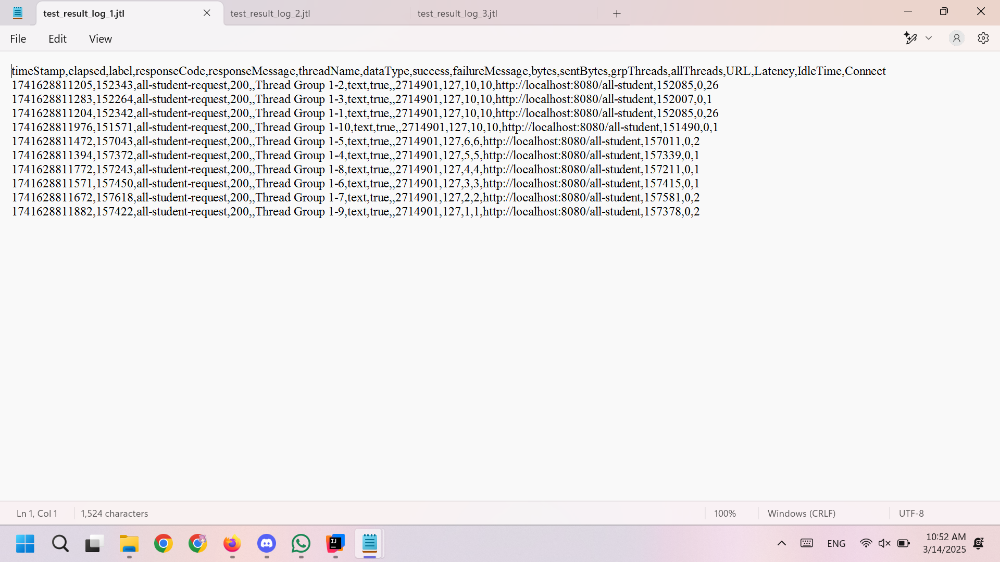
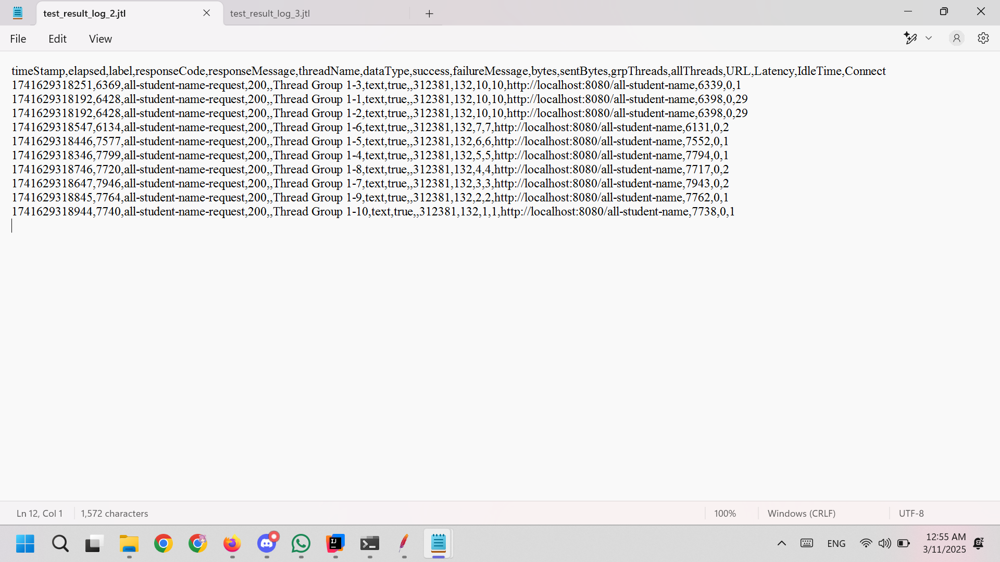
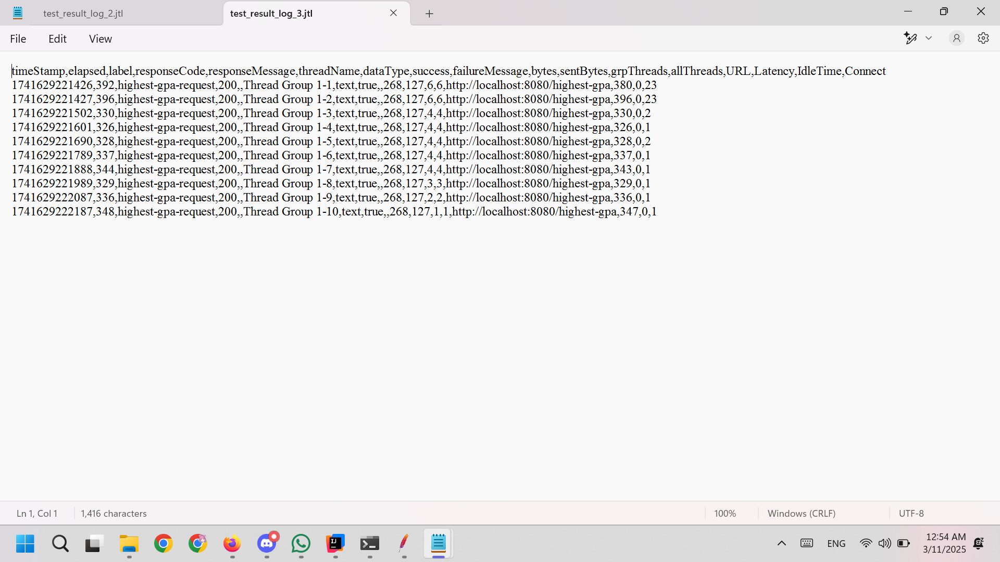

# Modul 5 - Profiling
## JMeter GUI
### `/all-student`

### `/all-student-name`

### `/highest-gpa`

## JMeter Report `.jtl`
### `/all-student`

### `/all-student-name`

### `/highest-gpa`

## Setelah Optimize
### `/all-student`

### `/all-student-name`

### `/highest-gpa`

- Pada setiap kasus, terlihat bahwa ada penurunan waktu per request lebih dari 20%, jika dilihat dari rata-rata, min, dan maks elapsed.
  
  - Pada endpoint `/all-student`, terdapat pengurangan maks elapsed dari 157618 menjadi 6369 (-96% pengurangan waktu)

  - Pada endpoint `/all-student-name`, terdapat pengurangan maks elapsed dari 7946 ke 195 (-97.5% pengurangan waktu)

  - Pada endpoint `/highest-gpa`, terdapat pengurangan maks elapsed dari 396 menjadi 169 (-57% pengurangan waktu)
  
- Ini menunjukkan bahwa _performance improvement_ dan _optimization_ dari profiling IntelliJ juga berpengaruh terhadap kenaikan dalam performance JMeter.

## Reflection
1. **What is the difference between the approach of performance testing with JMeter and profiling with IntelliJ Profiler in the context of optimizing application performance?**

   - Perbedaan antara performance testing dengan JMeter dan Profiler IntelliJ adalah testing JMeter bersifat lebih makro/umum dan berfungsi untuk menguji aplikasi dalam situasi seperti load tinggi. JMeter menguji tanpa melihat implementasi sehingga aplikasi kita menjadi _black box_. Sementara itu, profiler IntelliJ berfungsi untuk melihat performace dari aplikasi kita secara mikro lewat interaksinya dengan komponen CPU, memory, dan lain-lain, sehingga setiap bagian dari aplikasi kita dapat dianalisis untuk mengetahui bagian kode mana saja yang memakan sumber daya yang banyak.

2. **How does the profiling process help you in identifying and understanding the weak points in your application?**

    - Dengan profiling, saya menjadi lebih mudah dalam melakukan optimisasi karena saya bisa melihat banyak informasi tentang program saya. Misalnya, saya jadi tahu fungsi apa saja yang mengambil banyak waktu dan memori, dan baris mana saja khususnya yang memakan banyak waktu eksekusi.

3. **Do you think IntelliJ Profiler is effective in assisting you to analyze and identify bottlenecks in your application code?**

    - Menurut saya profiler IntelliJ efektif karena informasi yang disediakan lengkap sehingga kita tidak bingung mengenai kerja aplikasi kita. Setiap fungsi dan proses dalam aplikasi dirinci dalam laporan profiler. Kita juga mendapatkan timeline jalannya aplikasi kita dan setiap method dihitung waktu eksekusinya dengan akurat dan eksak sehingga kita tidak perlu menggunakan debugging manual lagi.

4. **What are the main challenges you face when conducting performance testing and profiling, and how do you overcome these challenges?**

    - Kadang-kadang saya bingung ketika melihat profiler IntelliJ karena ada begitu banyak informasi yang disajikan. Cara saya mengatasinya adalah membacanya dengan perlahan satu per satu dan hanya fokus kepada salah satu fungsi tertentu per profiling. Itu membantu saya untuk melakukan optimisasi dengan terurut dan sistematis. 

5. **What are the main benefits you gain from using IntelliJ Profiler for profiling your application code?**

    - Dengan menggunakan profiler IntelliJ, kode saya bisa lebih optimal dari segi waktu dan sumber daya (memori, CPU, dll). Hasilnya adalah pengguna akan merasa lebih senang ketika menggunakan aplikasi saya, dan penggunaan server juga akan lebih efisien sehingga kita tidak perlu mengeluarkan biaya yang banyak untuk menjalankan aplikasi.

6. **How do you handle situations where the results from profiling with IntelliJ Profiler are not entirely consistent with findings from performance testing using JMeter?**

    - Jika ada perbedaan hasil antara JMeter dan IntelliJ, saya berusaha untuk melakukan pengujian ulang pada kedua aplikasi tersebut. Biasanya hasil dari JMeter dan profiler tidak beda jauh, sehingga mungkin ada varians antar percobaan atau ada perbedaan dalam _environment_ seperti aplikasi background, penggunaan CPU background, dan lain-lain.

7. **What strategies do you implement in optimizing application code after analyzing results from performance testing and profiling? How do you ensure the changes you make do not affect the application's functionality?**

    - Biasanya saya berusaha untuk menerapkan beberapa _best practice_ yang saya tahu terlebih dahulu, misalnya menggunakan `StringBuilder` untuk operasi string, atau mengubah implementasi algoritma menjadi lebih efisien. Untuk memastikan bahwa perubahan yang saya lakukan tidak merusak aplikasi, saya menguji sendiri output program untuk memastikan bahwa output yang dihasilkan tetap sama. Selain itu dapat dilakukan testing dengan unit test, functional test, regression test, dan semua test suite yang sudah dipelajari dan dikembangkan sebelumnya untuk memastikan fungsionalitas aplikasi tidak terganggu.